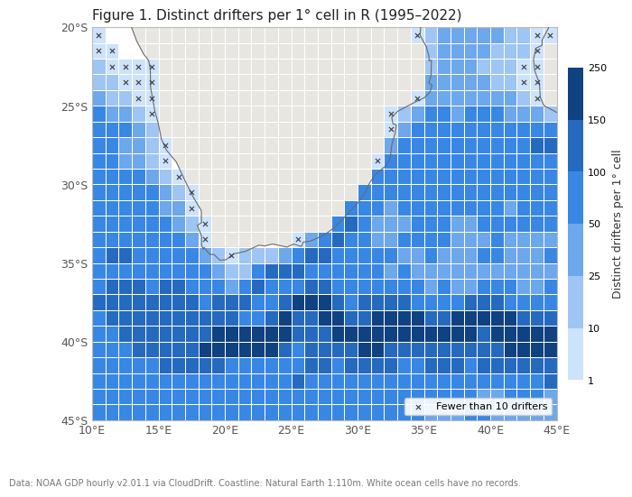

# Where things end up: surface transport in the Agulhas region

DATA3001, Term 3 2026 | Project 3.2.2 | Group 2

## 1. Research questions and objectives

**Aim.** How does the starting location in the Agulhas system change where floating material is likely to go? We will estimate a reusable surface-transport operator from historical drifter trajectories, comparing transport towards the western leakage and eastern return-current corridors.

- **RQ1 - Destinations:** For three supported starting states representing the coastal current, retroflection and return current, what destination probabilities are predicted after **7, 28 and 364 days**?
- **RQ2 - Connectivity:** Which parts of the region feed others, which are weakly connected, and where does a specified initial distribution concentrate or leave the region?
- **RQ3 - Reliability:** How well does the operator predict held-out drifters relative to persistence, and how sensitive are conclusions to time step, drogue status and season?

**Objectives and outputs.** Construct daily-origin, 7-day outcomes; estimate a 2-degree transition matrix; produce release and regional connectivity maps; evaluate whole held-out trajectories and sensitivity variants. Deliver a loadable matrix, state lookup, merge/support maps, exclusion counts, configuration, figures and a reproducible Python workflow that accepts another region. Completion requires non-negative probabilities, unit row sums, conserved propagated mass and evaluation denominators. The 28/364-day horizons approximate a month/year through four/52 weekly steps. Long-horizon results are extrapolations until directly validated.

## 2. Data/region and data description

**Region.** R is **10-45 degrees E, 45-20 degrees S**. It includes the coastal Agulhas Current, retroflection and eastward Return Current, with space west of Africa to observe westward transport. The western edge at 10 degrees E avoids stopping all westbound tracks immediately at the tip of Africa. Agulhas offers both stronger sampling and a release-location question involving contrasting pathways; Benguela was considered as an alternative (Table 1).

**Data.** We use NOAA GDP **hourly v2.01.1**, accessed through CloudDrift on **22 September 2026** (Elipot et al., 2016; Elipot et al., 2022). The product covers 1987-2022 globally; records in R span **31 March 1995-31 October 2022**. Its hourly positions are estimates from irregular satellite fixes, so repeated observations from one buoy are dependent. Data are stored as contiguous ragged trajectories: `rowsize` links observations to drifter `id`. We require `time`, `lon`, `lat`, `drogue_status`, `drogue_lost_date`, `typedeath` and deployment/end metadata; velocity and temperature are not required for endpoint transport. Load in chunks, identify entering drifters and retain full tracks, including outside positions.

**Table 1.** Candidate regions, counted with the same half-open boundary convention.

| Region | Longitude | Latitude | Hourly records | Distinct drifters |
|---|---|---|---:|---:|
| Agulhas, selected | 10-45 E | 45-20 S | 3,848,967 | 1,149 |
| Benguela, alternative | 0-20 E | 38-15 S | 2,538,266 | 706 |

Spatial and temporal sampling adequacy are summarised in Section 6.

## 3. Why this problem is important

The Agulhas carries Indian Ocean water along South Africa before retroflecting east; some water enters the Atlantic through Agulhas leakage. This exchange matters for ocean circulation and climate (Beal et al., 2011). Western boundary currents have high eddy variability (Lumpkin and Johnson, 2013), so a single path obscures the range of possible destinations.

Release-dependent probabilities can inform how search areas or pollution pathways are studied and give the client a reusable tool for regional transport analysis. Drifters are established observing platforms for evaluating ocean conditions and forecasts (Centurioni et al., 2019). They are imperfect proxies for life rafts, oil or plastic: drogue status, buoyancy, wind and waves affect motion differently. Our operator estimates historical drifter transport, rather than an operational forecast for a specific object. West/east box exits are directional proxies, not direct measurements of Atlantic/Indian Ocean exchange.

## 4. Background and existing studies

Lumpkin and Johnson (2013) estimated global mean and seasonal surface velocities from drogued drifters. Such Eulerian maps describe local flow, whereas our Lagrangian question concerns where material travels. Russo et al. (2021) investigated spatial and temporal variability of the Agulhas Retroflection using satellite observations, motivating a seasonal comparison rather than assuming a fixed separation pattern.

**Closest method.** McAdam and van Sebille (2018) constructed drifter-based transition matrices and investigated Agulhas transport and connectivity using different grid sizes and 5-, 20-, 60- and 180-day steps. Gridding can artificially connect different flows within one cell; their idealised experiments showed greater artificial dispersion with larger cells and shorter steps. Real-ocean parameter effects were less simple, so sensitivity must be reported rather than assuming one setting is correct.

Our project applies this established method to the hourly GDP product with a weekly step, compares three regional release regimes and evaluates predictions on whole drifters excluded from estimation. Its contribution is a reproducible regional application and explicit evaluation, not a new transition-matrix theory. The literature's interocean percentages are not numerical targets: its crossing boundaries, treatment of recirculation and horizons differ from our rectangular first-exit operator. Support checks, interval sensitivity and transparent limitations will determine whether our questions are answerable.

## 5. Proposed method

**Preparation and split.** Audit coordinates, longitude convention, timestamps, duplicates, hourly gaps, termination metadata and drogue flags. Save an **80/20 split by complete drifter ID, seed 42**, before defining support, merged states or release locations. Missing or ambiguous observations receive reason codes; no extra interpolation is introduced. Any tuning uses training drifters only.

**Daily outcomes.** Use exact 00:00 UTC origins in R and locate the same drifter **168 hours later by timestamp**. Inspect intervening hourly positions. Stop at the first observed exit, even if the buoy returns, assigning west/east/north/south by the segment's first boundary crossing. A confirmed terminal `typedeath = 1` inside R gives a separate grounded outcome, using the terminal time as a proxy. Other early endings are censored; gaps before an outcome make it unusable. An already observed exit/grounding remains usable without a day-7 endpoint. Drogue loss is not termination. Log invalid and censored origins by cell and season because missing outcomes may be informative.

**States and probabilities.** Start with **2-degree cells**, anchored at the south-west corner with half-open bounds and clipped edge cells. Merge sparse cells with adjacent observed cells until retained origin groups have at least **10 distinct training drifters with usable outcomes**. Recount unique IDs after merging; occupancy alone is insufficient. Use a deterministic shared-edge neighbour rule, then freeze and publish the training-only lookup. Unsupported origins are excluded and reported; residual unsupported destinations enter a separately reported unresolved diagnostic, preserving their probability. Estimate **P_ij = N_ij / sum_j N_ij**, where N_ij counts usable training outcomes from i to j. Exits, grounding and unresolved are absorbing. Ten contributors is a support rule, not a guarantee of precision; merging also reduces spatial resolution.

**Transport and interpretation.** Choose three supported training states by geography, recording coordinates, merged extent and support before test evaluation. Propagate a row distribution as **p(k) = p(0) P^k**, using P, P^4 and P^52 for 7/28/364 days. Map absolute remaining mass and each absorbing fraction. For RQ2, start with equal mass per supported state, analyse directed connections and concentration conditional on survival, and report surviving mass. This scenario is not measured debris density or uniform concentration over unequal-area groups. First-exit absorption excludes later re-entry; annual propagation assumes stationary first-order Markov transport.

**Validation and variants.** On untouched test drifters, report top-three destination coverage against persistence, which supplies one positive-probability guess. Report the asymmetry, predicted top-three mass, usable sample counts, unsupported-origin coverage and pooled/per-drifter scores. Separate geographic successes from exits, grounding and unresolved. Add Brier score as a probability comparison. Fit **drogued-only, 3-day and DJF/MAM/JJA/SON** variants on the same split, recomputing training support/merges; compare physical exits or compatible geographic reporting regions. Require known drogued status throughout each observed interval. Compare 3-/7-day operators at **21 days** and seasonal one-step behaviour first. Later checks include direct 28-day outcomes, whole-drifter bootstrap, equal-drifter weighting and 1-degree grids; seasonal multi-step propagation requires common states and calendar switching. Save all results and exclusions, including weak or negative findings.

## 6. Initial analysis and visualization

**Spatial adequacy.** At 2 degrees, **178/234 cells** are occupied; **171** have at least 10 drifters, with median **116** and IQR **76-168**. At 1 degree, **649/875** cells are occupied, **614** have at least 10 and the median is **71** (Figure 1). These are occupancy statistics, not post-split transition support. Empty ocean cells are unsampled; they must not automatically be labelled land.

*Figure 1. Historical coverage in R, 1995-2022. Crosses mark fewer than 10 drifters. Data: NOAA GDP hourly v2.01.1; coastline: Natural Earth. This map motivates checking spatial support before estimating P.*

**Time and measurement coverage.** All 28 calendar years have records, but coverage is uneven: the median is 65 drifters/year, from 4 in 1997 to 128 in 2016. Seasonal drifter counts are DJF **676**, MAM **704**, JJA **735** and SON **714**; a buoy can appear in multiple seasons. Only **33.3%** of regional records are drogued by the loss-date rule, with **99.9%** agreement with the per-record flag. Drogued-only support is therefore weaker and must be reassessed, not assumed equal to all-track support.

**Termination audit.** Of 1,149 entering drifters, 840 have their last observation outside R. Of the 309 ending inside, 70 are confirmed grounded and 203 stop transmitting; the other 36 are also censored. These final-record categories do not measure daily-origin first-exit probabilities. Together, the checks support attempting the proposed analysis while highlighting sparse early years, drogue differences and censoring.

## Proposed timeline

| Milestone | Planned work and completion check |
|---|---|
| Week 4 | Finalise and review proposal, figure and citations; freeze and submit |
| Week 5, Session 2 | Present poster: region, initial evidence and method; complete peer feedback |
| Week 5, end | Audit full tracks; save split IDs and 7-day outcomes; check events and censoring |
| Week 6, end | Merge supported states; estimate P; check row sums and mass conservation |
| Week 7, end | Map 7/28/364-day release destinations, absorbing fractions and regional connectivity |
| Week 8, end | Evaluate against persistence; report top-three coverage, Brier score and denominators |
| Week 9, end | Compare drogue, 3-day and seasonal variants; summarise sensitivity and limitations |
| Week 10 | Rehearse and present checked results; draft final report |
| Exam period | Review report, reproducibility and AI reflection; freeze 24 hours before submission |

## References

- Beal, L. M., de Ruijter, W. P. M., Biastoch, A., Zahn, R., and SCOR/WCRP/IAPSO Working Group 136 (2011). On the role of the Agulhas system in ocean circulation and climate. *Nature*, 472, 429-436. [doi:10.1038/nature09983](https://doi.org/10.1038/nature09983).
- Centurioni, L. R., et al. (2019). Global in situ Observations of Essential Climate and Ocean Variables at the Air-Sea Interface. *Frontiers in Marine Science*, 6, 419. [doi:10.3389/fmars.2019.00419](https://doi.org/10.3389/fmars.2019.00419).
- Elipot, S., Lumpkin, R., Perez, R. C., Lilly, J. M., Early, J. J., and Sykulski, A. M. (2016). A global surface drifter data set at hourly resolution. *Journal of Geophysical Research: Oceans*, 121, 2937-2966. [doi:10.1002/2016JC011716](https://doi.org/10.1002/2016JC011716).
- Elipot, S., Sykulski, A., Lumpkin, R., Centurioni, L., and Pazos, M. (2022). *Hourly location, current velocity, and temperature collected from Global Drifter Program drifters world-wide*. NOAA NCEI, v2.01.1; Agulhas subset; accessed 2026-09-22. [doi:10.25921/x46c-3620](https://doi.org/10.25921/x46c-3620).
- Lumpkin, R., and Johnson, G. C. (2013). Global ocean surface velocities from drifters: Mean, variance, El Niño-Southern Oscillation response, and seasonal cycle. *Journal of Geophysical Research: Oceans*, 118, 2992-3006. [doi:10.1002/jgrc.20210](https://doi.org/10.1002/jgrc.20210).
- McAdam, R., and van Sebille, E. (2018). Surface Connectivity and Interocean Exchanges From Drifter-Based Transition Matrices. *Journal of Geophysical Research: Oceans*, 123, 514-532. [doi:10.1002/2017JC013363](https://doi.org/10.1002/2017JC013363).
- Russo, C. S., Lamont, T., and Krug, M. (2021). Spatial and temporal variability of the Agulhas Retroflection: Observations from a new objective detection method. *Remote Sensing of Environment*, 253, 112239. [doi:10.1016/j.rse.2020.112239](https://doi.org/10.1016/j.rse.2020.112239).
